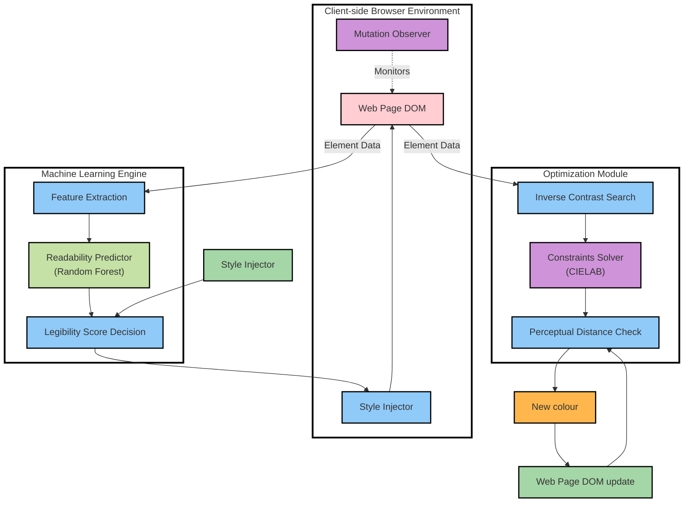

# System Architecture - Actual Implementation

## Overview

This document presents the actual system architecture as implemented in the codebase, based on code analysis.

## Architecture Diagram - Visual Layout

This diagram matches the visual structure and style of the original design:



**Note on Actual Implementation Flow:**
- In the actual code, ML evaluation happens BEFORE color optimization (not after DOM update)
- ML acts as a veto mechanism (approves/rejects), not a color generator
- The visual layout above matches the original diagram structure, but execution order differs as documented in the detailed flow below

## Detailed Execution Flow Diagram

```mermaid
flowchart TD
    Start([User Initiates Scan]) --> ScanInit[scanWithAI Function]
    
    ScanInit --> AnalyzeSections[Analyze Sections by Z-Index]
    AnalyzeSections --> ResolveBackend[Resolve Backend Health]
    ResolveBackend --> MLAvailable{ML Available?}
    
    MLAvailable -->|Yes| MLMode[ML Mode Enabled]
    MLAvailable -->|No| WCAGMode[WCAG-Only Mode]
    
    MLMode --> ProcessElements[Process Elements in Sections]
    WCAGMode --> ProcessElements
    
    ProcessElements --> ForEachElement[For Each Element]
    
    ForEachElement --> SkipCheck{shouldSkipContrastFix?}
    SkipCheck -->|Yes| SkipElement[Skip Element]
    SkipCheck -->|No| GetElementData[Get Element Data]
    
    GetElementData --> GetBackground[Get Effective Background]
    GetBackground --> GetForeground[Get Foreground Color]
    GetForeground --> CalculateContrast[Calculate Current Contrast]
    
    CalculateContrast --> MLCheck{ML Available<br/>AND<br/>Conditions Met?}
    
    MLCheck -->|Yes| ExtractFeatures[Extract Element Features]
    MLCheck -->|No| OnDeviceCheck[On-Device Readability Check]
    
    ExtractFeatures --> CallML[callBackendReadability]
    CallML --> MLResponse[ML Response:<br/>comfortable, comfort_score]
    
    MLResponse --> MLDecision{ML Veto?<br/>comfortable=true<br/>AND score>=0.5}
    MLDecision -->|Yes| SkipCorrection[Skip Correction<br/>ML Says Readable]
    MLDecision -->|No| ColorOptimization
    
    OnDeviceCheck --> ColorOptimization[Color Optimization Module]
    
    ColorOptimization --> CIELABConvert[Convert RGB to CIELAB]
    CIELABConvert --> InverseSearch[Inverse Search:<br/>Adjust L* while<br/>holding a*, b* constant]
    
    InverseSearch --> PerceptualCheck[Perceptual Distance Check<br/>Delta E 2000]
    PerceptualCheck --> FindOptimal[Find Optimal Color<br/>Min Delta E<br/>Meets Target Contrast]
    
    FindOptimal --> OptimalColor[Optimal Color RGB]
    
    OptimalColor --> ValidateContrast{Contrast >= Target?}
    ValidateContrast -->|No| HSLFallback[Rule-Based HSL Fallback]
    ValidateContrast -->|Yes| ApplyStyle
    
    HSLFallback --> ApplyStyle[Apply Style to DOM]
    
    ApplyStyle --> ApplyColorImportant[applyColorWithImportant]
    ApplyColorImportant --> InjectStylesheet[injectStylesheet if needed]
    InjectStylesheet --> MarkFixed[Mark Element as Fixed]
    
    MarkFixed --> NextElement{More Elements?}
    NextElement -->|Yes| ForEachElement
    NextElement -->|No| StartObserver[Start MutationObserver<br/>for Dynamic Content]
    
    StartObserver --> End([Scan Complete])
    
    SkipElement --> NextElement
    SkipCorrection --> NextElement
    
    style ColorOptimization fill:#e1f5ff
    style MLResponse fill:#fff4e1
    style ApplyStyle fill:#e8f5e9
    style SkipCheck fill:#ffebee
    style MLDecision fill:#fff4e1
```



## Component Details

### 1. Client-Side Browser Environment

#### Web Page DOM
- **Function:** Source of elements to process
- **Location:** `extension/content.js`
- **Access:** Via `document.body`, `document.querySelectorAll()`

#### Mutation Observer
- **Function:** Monitors DOM changes for dynamic content
- **Location:** `extension/content.js` line 13016
- **Function Name:** `startObservingDynamicContent()`
- **Triggers:** After scan completes, watches for new elements

#### Style Injector
- **Functions:**
  - `applyColorWithImportant(el, property, value)` - line 3294
  - `injectStylesheet(css)` - line 1220
- **Purpose:** Applies corrected colors with !important flag

### 2. Background Resolution System

#### Section Analysis
- **Function:** `analyzeSections()` - line 7279
- **Purpose:** Pre-scans all sections, sorts by z-index
- **Output:** Section background cache with z-index ordering

#### Effective Background Resolution
- **Function:** `getEffectiveBackgroundRGBA()` - resolves from ancestor chain
- **Function:** `getEffectiveBackgroundInfo()` - provides background metadata
- **Purpose:** Determines actual visible background color

### 3. Skip Logic

#### Element Filtering
- **Function:** `shouldSkipContrastFix()` - line 8135
- **Filters:**
  - Elements with image backgrounds
  - Elements with transparent backgrounds
  - Elements in video slides
  - Elements already processed

### 4. Machine Learning Engine (Optional)

#### Feature Extraction
- **Client-side:** `extractElementContext()` - line 8654
- **Server-side:** `FeatureEngine.extract()` - `api/services/feature_engine.py` line 16
- **Extracts:** RGB, contrast, font size, font weight, element type, user scale

#### ML Backend Call
- **Function:** `callBackendReadability()` - line 10262
- **Endpoint:** `/readability` - `api/server.py` line 217
- **Returns:** `comfortable` (boolean), `comfort_score` (0-1), `expected_contrast`

#### ML Decision Logic
- **Location:** `extension/content.js` lines 8743-8752
- **Veto Condition:** If `comfortable === true` AND `comfort_score >= 0.5`, skip correction
- **Note:** ML is prediction-only, does not generate colors

### 5. Color Optimization Module

#### CIELAB Conversion
- **Functions:**
  - `_rgb_to_lab(r, g, b)` - line 431
  - `rgbToLab()` - line 560
  - `labToRgb()` - line 601

#### Inverse Contrast Search
- **Function:** `findOptimalColorWithMinDeltaE()` - line 6176
- **Strategy:** Adjusts L* (lightness) in CIELAB space while holding a* and b* constant
- **Search Range:** L* from 0 to 100, step 0.5
- **Goal:** Find color with minimum Delta E that meets target contrast

#### Perceptual Distance Check
- **Function:** `deltaE2000()` - line 650
- **Function:** `_delta_e_2000(lab1, lab2)` - line 466
- **Purpose:** Calculates perceptual color difference using Delta E 2000

#### Main Optimization Function
- **Function:** `adjustColorToContrast(fgRGB, bgRGB, targetRatio, options)` - line 6074
- **Returns:** RGB array `[r, g, b]`
- **Fallback:** `ruleBasedHslFallback()` if CIELAB fails - line 337

### 6. Style Application

#### Color Application
- **Function:** `applyColorWithImportant()` - line 3294
- **Process:**
  1. Remove existing property from style attribute
  2. Set new property with !important flag
  3. Verify applied color matches expected
  4. Inject stylesheet if inline style fails

#### Element Marking
- **Attribute:** `data-ai-contrast-fixed="true"`
- **Purpose:** Prevents reprocessing same element

## Data Flow

### Primary Flow (ML Available)

```
1. scanWithAI() initiated
2. analyzeSections() - pre-scan sections
3. resolveBackendHealth() - check ML availability
4. For each element:
   a. shouldSkipContrastFix() - filter check
   b. Get element data (FG, BG, contrast)
   c. Extract features (if ML available)
   d. callBackendReadability() - ML prediction
   e. ML decision (veto or proceed)
   f. adjustColorToContrast() - CIELAB optimization
   g. applyColorWithImportant() - apply style
   h. Mark element as fixed
5. Start MutationObserver for dynamic content
```

### Fallback Flow (ML Unavailable)

```
1. scanWithAI() initiated
2. analyzeSections() - pre-scan sections
3. resolveBackendHealth() - ML unavailable
4. For each element:
   a. shouldSkipContrastFix() - filter check
   b. Get element data (FG, BG, contrast)
   c. On-device readability check (WCAG-only)
   d. adjustColorToContrast() - CIELAB optimization
   e. applyColorWithImportant() - apply style
   f. Mark element as fixed
5. Start MutationObserver for dynamic content
```

## Key Differences from Original Diagram

1. **ML Timing:** ML evaluation happens BEFORE color optimization, not after DOM update
2. **ML Role:** ML is prediction-only (veto mechanism), does not generate colors
3. **Execution Order:** Element data → ML check → Color optimization → Style injection
4. **No Feedback Loop:** ML decision does not feed back to optimization; it only prevents style application
5. **Background Resolution:** Separate pre-scan phase for section analysis
6. **Skip Logic:** Early filtering before any processing

## Component Locations

| Component | File | Line(s) |
|-----------|------|---------|
| scanWithAI | extension/content.js | 10296 |
| analyzeSections | extension/content.js | 7279 |
| processElementForContrast | extension/content.js | 8225 |
| shouldSkipContrastFix | extension/content.js | 8135 |
| adjustColorToContrast | extension/content.js | 6074 |
| findOptimalColorWithMinDeltaE | extension/content.js | 6176 |
| applyColorWithImportant | extension/content.js | 3294 |
| callBackendReadability | extension/content.js | 10262 |
| startObservingDynamicContent | extension/content.js | 13016 |
| FeatureEngine.extract | api/services/feature_engine.py | 16 |
| ModelLoader.predict | api/services/model_loader.py | 99 |
| /readability endpoint | api/server.py | 217 |

## Notes

- All color optimization happens on-device using CIELAB functions
- ML backend is optional; system works in WCAG-only mode if unavailable
- ML provides comfort prediction but does not generate color suggestions
- Style injection uses !important flag to override existing styles
- MutationObserver watches for dynamic content after initial scan
- Background resolution uses ancestor chain traversal to find effective background

